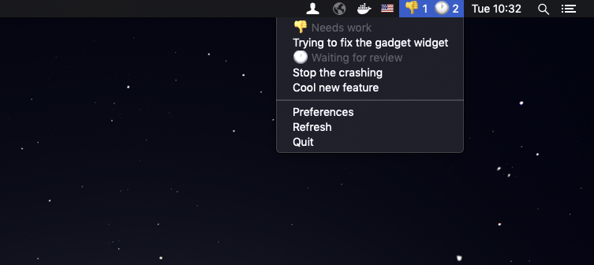

# DevBar



DevBar is a workflow tool for developers. It watches a URL and displays a menu bar so you can easily see actions you can take, like pull requests that needs a review, PRs that have failing tests, etc.

# Installation

Install it from the AppStore: https://apps.apple.com/se/app/devbar/id1462747827?l=en&mt=12

# Usage

Start DevBar. It will ask you for a URL to watch, and it will add a username query parameter (so if you give it https://example.com/foo it will access https://example.com/foo?username=username). The endpoint should reply with a JSON document that looks something like this:


```json
{
    "data": {
        "needs_work": [
            {
                "title": "Trying to fix the gadget widget",
                "url": "https://github.com/example/prs/1",
            }
        ],
        "other_problems": [],
        "waiting_for_review": [
            {
                "title": "Stop the crashing",
                "url": "https://github.com/example/prs/2",
            },
            {
                "title": "Cool new feature",
                "url": "github.com/example/prs/3",
            }
        ],
        "devtest": [],
        "ready_to_merge": [],
        "workflow_problem": [],
        "wip": []
    },
    "metadata": {
        "display": {
            "prod_crash": {
                "priority": 0,
                "symbol": "💥",
                "title": "💥 Prod crash"
            },
            "other_problems": {
                "priority": 10,
                "symbol": "😟",
                "title": "😟 Other problems"
            },
            "waiting_for_review": {
                "priority": 10,
                "symbol": "🕐",
                "title": "🕐 Waiting for review"
            },
            "devtest": {
                "priority": 10,
                "symbol": "🧪",
                "title": "🧪 Can be tested by developers"
            },
            "ready_to_merge": {
                "priority": 10,
                "symbol": "🎉",
                "title": "🎉 Ready to merge"
            },
            "workflow_problem": {
                "priority": 10,
                "symbol": "🤨",
                "title": "🤨 Workflow problem: should be 4EYE or ready for test"
            },
            "wip": {
                "priority": 11,
                "symbol": "🚧",
                "title": "🚧 Work in progress"
            }
        }
    }
}
```

`metadata.display` is a dict of the different workflow types you've got. The symbol is used in the menu bar as a compact representation and the title is the full title displayed in the drop down menu.


You can give it a spin by pointing it to the example.json file: `https://raw.githubusercontent.com/boxed/DevBar/master/example.json?`

Your server can also respond with 503 to signal it's not ready yet. This is handy for when you have a cache that needs to be warmed up after the server side is restarted. Just return 503 until you're done and DevBar won't show the server as down but will just keep showing the data it had last time.
